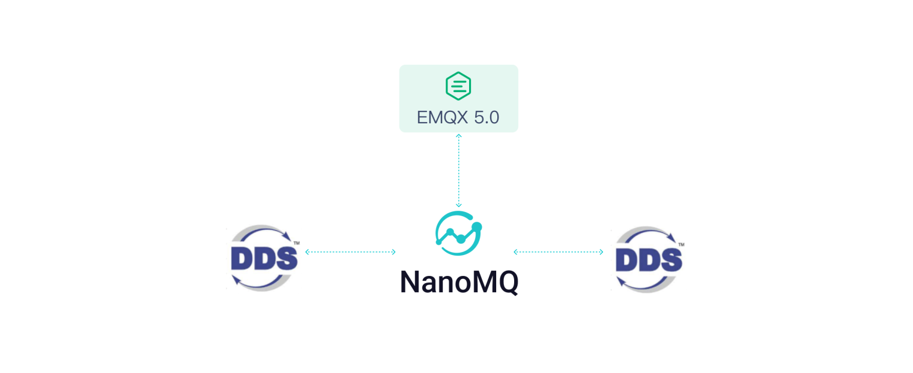

# DDS Proxy

数据分发服务 DDS 是是一种以数据为中心的分布式实时通信中间件协议。采用发布/订阅体系架构，提供丰富的 QoS 服务质量策略，以保障数据进行实时、高效、灵活地分发，可以满足各种去中心化的实时通信应用需求。

[Cyclone DDS](https://cyclonedds.io/) 是一款基于 OMG (Object Management Group) DDS 规范的开源 DDS 实现，用于发布/订阅消息的实时系统。NanoMQ 自 v0.16 版本引入了基于 Cyclone DDS 开发的 DDS Proxy 插件，此插件能够完成将 DDS 消息转换为 MQTT 消息并桥接上云，支持用户将 DDS 的数据通过 NanoMQ 来完成跨域传输并通过 MQTT 和云端互通。

结合 MQTT + DDS 两种协议，DDS 网关可以完美融合 broker + brokerless 两种消息模式，有效实现云边一体化的消息场景。



## 前置准备

启动 DDS 网关之前，需要先安装 CycloneDDS 和 Iceoryx。CycloneDDS 是 DDS 网关的核心依赖，而 Iceoryx 是 CycloneDDS 通过共享内存通信所需的依赖。

### CycloneDDS

安装 CycloneDDS，请将 `DDS_LIBRARY_PATH` 替换为 DDS 库的实际安装路径。

```bash
$ git clone https://github.com/eclipse-cyclonedds/cyclonedds.git
$ cd cyclonedds
$ mkdir build && cd build
$ cmake -G Ninja -DCMAKE_INSTALL_PREFIX={DDS_LIBRARY_PATH} -DCMAKE_PREFIX_PATH={DDS_LIBRARY_PATH} -DBUILD_EXAMPLES=ON ..
$ ninja 
$ sudo ninja install
```

### Iceoryx

:::tip

如果不需要共享内存 IPC，可以跳过安装 Iceoryx。

:::

```bash
$ git clone https://github.com/eclipse-iceoryx/iceoryx.git
$ cd iceoryx
$ git checkout release_2.0
$ mkdir build && cd build
$ cmake -G Ninja -DCMAKE_INSTALL_PREFIX={USER_LIBRARY_PATH} ../iceoryx_meta
$ ninja
$ sudo ninja install
```

## 启用 NanoMQ DDS Proxy

### 编译安装 IDL 代码生成器

在 DDS 中，IDL (Interface Definition Language) 代码生成器主要负责将由 IDL 编写的接口定义转化为一种特定的编程语言的源代码。为了方便用户能够简单快速上手 DDS Proxy 功能，NanoMQ 提供了 IDL 代码生成器：[idl-serial-code-gen](https://github.com/nanomq/idl-serial)，用于根据用户的 DDS IDL 文件来自动生成 JSON 序列化和反序列化代码。

运行以下代码编译 `IDL` 代码生成器 `idl-serial` 

```bash
$ git clone https://github.com/nanomq/idl-serial.git
$ cd idl-serial
$ mkdir build && cd build
$ cmake -G Ninja -DCMAKE_INSTALL_PREFIX={DDS_LIBRARY_PATH} ..
$ ninja 
$ sudo ninja install
```

编译完成生成可执行文件 `idl-serial-code-gen`。

### 生成 Json<->Struct 转换代码

使用 `idl` 文件 `dds_structs.idl` 生成 `C` 代码 `idl_convert.c` 和 `idl_convert.h`

```
## 生成C代码 idl_convert.c 和 idl_convert.h
$ ./idl-serial-code-gen  dds_structs.idl  idl_convert
```

### 编译 NanoMQ DDS Proxy

1. 将以上步骤中生成的代码文件 `idl_convert.c` 和 `idl_convert.h` 拷贝到 `nanomq_cli/dds2mqtt` 路径下

2. 通过 cmake 参数 `IDL_FILE_PATH` 指定 `idl` 文件路径 (不指定则默认为工程路径下的 `etc/idl/dds_type.idl`)

   ```
   $ git clone https://github.com/emqx/nanomq.git $ cd nanomq $ mkdir build && cd build $ cmake -G Ninja -DIDL_FILE_PATH={IDL_PATH} -DCMAKE_PREFIX_PATH={DDS_LIBRARY_PATH} -DBUILD_DDS_PROXY=ON .. $ ninja  $ sudo ninja install
   ```

3. 执行以下命令查看是否已编译  `dds`

   ```
   $ ./nanomq_cli/nanomq_cli  nanomq_cli { pub | sub | conn | nngproxy | nngcat | dds } [--help] available tools:   * pub   * sub   * conn   * nngproxy   * nngcat   * dds Copyright 2022 EMQ Edge Computing Team
   ```

## 配置 DDS Proxy

开始使用前，首先通过 `/etc/nanomq_dds_gateway.conf` 配置文件来设置需要桥接和转发的 MQTT 和 DDS 主题。

```bash
## 转发规则配置
forward_rules = {
	  ## DDS to MQTT
    dds_to_mqtt = {
        from_dds = "MQTTCMD/topic1"
        to_mqtt = "DDS/topic1"
        struct_name = "remote_control_result_t"
    }
    ## MQTT to DDS
    mqtt_to_dds = {
        from_mqtt = "DDSCMD/topic1"
        to_dds = "MQTT/topic1"
        struct_name = "remote_control_req_t"
    }
}

## DDS 配置参数
dds {
    domain_id = 0
    
    shared_memory = {
        enable = false
        log_level = info
    }
}

## MQTT 配置参数
mqtt {
	connector {
        server = "mqtt-tcp://127.0.0.1:1883"
        proto_ver = 4
        keepalive = 60s
        clean_start = false
        username = username
        password = passwd
        
        ssl {
            enable = false
            key_password = "yourpass"
            keyfile = "/etc/certs/key.pem"
            certfile = "/etc/certs/cert.pem"
            cacertfile = "/etc/certs/cacert.pem"
        }
    }
}
```

其中的重点配置项包括：

**DDS 订阅与 MQTT 发布**

- DDS 订阅 Topic：`forward_rules.dds_to_mqtt.from_dds = "MQTTCMD/topic1"`
- MQTT 发布 Topic：`forward_rules.dds_to_mqtt.to_mqtt = "DDS/topic1"`
- 指定接收的 DDS 结构体名称：`forward_rules.dds_to_mqtt.struct_name = "remote_control_result_t"`

**MQTT 订阅与 DDS 发布**

- MQTT 订阅 Topic：`forward_rules.dds_to_mqtt.from_dds = "DDSCMD/topic1"`
- DDS 发布 Topic：`forward_rules.dds_to_mqtt.to_mqtt = "MQTT/topic1"`
- 指定发布的 DDS 结构体名称：`forward_rules.dds_to_mqtt.struct_name = "remote_control_req_t"`

### 测试  DDS Proxy

1. 启动 MQTT Broker

   ```bash
   $ nanomq start
   ```

   或

   ```
   $ emqx start
   ```


2. 启动 DDS Proxy

   ```bash
   $ ./nanomq_cli dds proxy --conf nanomq_dds_gateway.conf
   ```

3. 启动 MQTT 客户端订阅主题 `DDS/topic1`

   ```bash
   $ ./nanomq_cli sub --url "mqtt-tcp://127.0.0.1:1883" -t "DDS/topic1"
   ```

4. 启动 DDS 客户端, 指定结构体名称`remote_control_result_t`并发布消息(*命令行参数为 JSON 格式*)到 DDS 主题 `MQTTCMD/topic1`

   ```bash
   $ ./nanomq_cli dds pub -t "MQTTCMD/topic1" --struct             "remote_control_result_t"  -m '{
    "req_result_code": 1,
    "req_token": [1,2,3,4,5,6],
    "req_result_msg": [7,8,9,10,11],
    "req_id": [12,13,14],
    "req_token_len": 6,
    "req_id_len": 3
   }'
   ```

5. 启动 DDS 客户端订阅 DDS 主题 `MQTT/topic1`并指定接收的结构体名称`remote_control_req_t`

   ```bash
   $ ./nanomq_cli dds sub -t "MQTT/topic1" --struct    "remote_control_req_t"
   ```

6. 启动 MQTT 客户端发布消息(*JSON*)到 MQTT 主题 `DDSCMD/topic1`

   ```bash
   $ ./nanomq_cli pub --url "mqtt-tcp://127.0.0.1:1883" -t "DDSCMD/topic1" -m '{ 
    "req": 1,         
    "req_id": [15,16],
    "req_id_len": 2
    }'
   ```